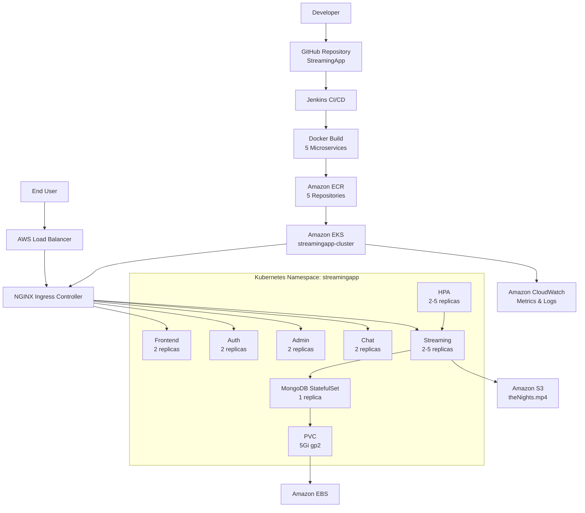
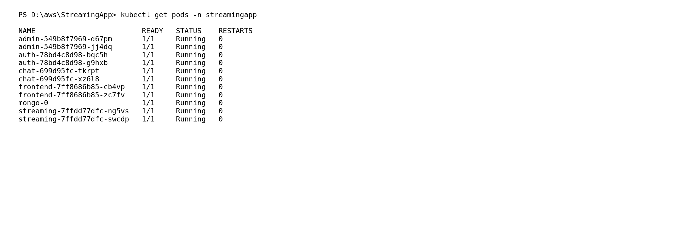
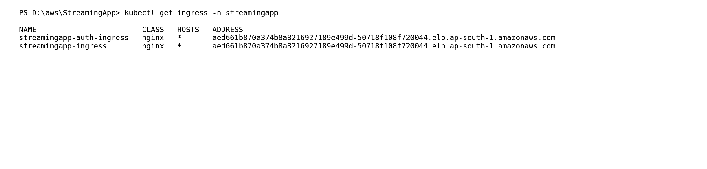
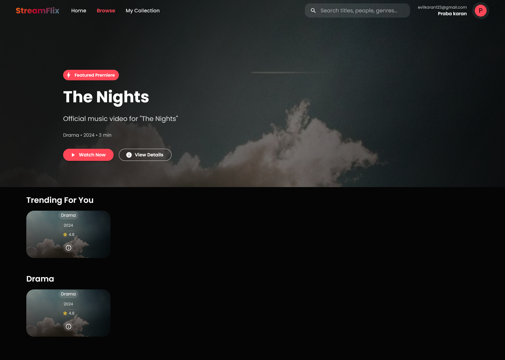

# StreamingApp – Kubernetes Container Orchestration & CI/CD

A microservices-based video streaming application deployed to **Amazon EKS** using **Docker, Amazon ECR, Kubernetes, Helm, Jenkins, NGINX Ingress, Amazon S3, and CloudWatch**.

**GitHub Repository:** https://github.com/karan11619/StreamingApp

**AWS Region:** `ap-south-1` (Mumbai)

---

## Architecture

```text
                         ┌──────────────────────────┐
                         │        Developer         │
                         │                          │
                         │      git push → main     │
                         └────────────┬─────────────┘
                                      │
                                      ▼
                         ┌──────────────────────────┐
                         │       GitHub Repo        │
                         │  karan11619/StreamingApp │
                         └────────────┬─────────────┘
                                      │
                                      ▼
              ┌──────────────────────────────────────────┐
              │             Jenkins CI/CD                │
              │                                          │
              │  1. Checkout                             │
              │  2. Build 5 Docker images                │
              │  3. Login to Amazon ECR                  │
              │  4. Tag images                           │
              │  5. Push images to ECR                   │
              │  6. Update EKS kubeconfig                │
              │  7. Helm upgrade                         │
              │  8. Kubernetes rollout validation        │
              └──────────────────┬───────────────────────┘
                                 │
                                 ▼
              ┌──────────────────────────────────────────┐
              │              Amazon ECR                  │
              │                                          │
              │ streaming-auth                           │
              │ streaming-admin                          │
              │ streaming-chat                           │
              │ streaming-frontend                       │
              │ streaming-service                        │
              └──────────────────┬───────────────────────┘
                                 │
                                 ▼
              ┌──────────────────────────────────────────┐
              │             Amazon EKS                   │
              │        streamingapp-cluster              │
              │                                          │
              │  ┌────────────────────────────────────┐  │
              │  │ Namespace: streamingapp            │  │
              │  │                                    │  │
              │  │ NGINX Ingress                      │  │
              │  │       │                            │  │
              │  │       ├── Frontend (2)              │  │
              │  │       ├── Auth (2)                  │  │
              │  │       ├── Admin (2)                 │  │
              │  │       ├── Chat (2)                  │  │
              │  │       └── Streaming (2-5)           │  │
              │  │              │                      │  │
              │  │              ├── Amazon S3           │  │
              │  │              └── MongoDB StatefulSet │  │
              │  │                         │            │  │
              │  │                         └── EBS      │  │
              │  └────────────────────────────────────┘  │
              │                                          │
              │  HPA: 2-5 replicas                       │
              │  CloudWatch: metrics and logs            │
              └──────────────────┬───────────────────────┘
                                 │
                                 ▼
                         ┌──────────────────┐
                         │    End User      │
                         │                  │
                         │ AWS LoadBalancer │
                         │       ↓          │
                         │ NGINX Ingress    │
                         └──────────────────┘
```

### Mermaid Architecture



---

# Application

StreamingApp is a microservices video streaming application consisting of:

- Frontend
- Authentication service
- Administration service
- Chat service
- Streaming service
- MongoDB

The application is containerized and deployed as Kubernetes workloads.

---

# Main Deployment Steps

## 1. Create Amazon EKS Cluster

Cluster:

```text
streamingapp-cluster
```

Region:

```text
ap-south-1
```

The cluster contains three worker nodes.

### Command

```powershell
kubectl get nodes -o wide
```

### Output

```text
NAME                                            STATUS   ROLES    AGE     VERSION
ip-192-168-24-91.ap-south-1.compute.internal    Ready    <none>   5h26m   v1.34.10-eks-cb19647
ip-192-168-62-21.ap-south-1.compute.internal    Ready    <none>   5h28m   v1.34.10-eks-cb19647
ip-192-168-86-203.ap-south-1.compute.internal   Ready    <none>   4h54m   v1.34.10-eks-cb19647
```

### Screenshot


---

## 2. Configure Kubernetes Namespace

Application workloads are deployed into:

```text
streamingapp
```

Example:

```powershell
kubectl get pods -n streamingapp
```

All application resources are managed within this namespace.

---

## 3. Configure Persistent Storage for MongoDB

MongoDB uses a Kubernetes PersistentVolumeClaim backed by AWS EBS.

Configuration:

```text
Capacity: 5Gi
Access Mode: RWO
StorageClass: gp2
```

### Command

```powershell
kubectl get pvc -n streamingapp
```

### Output

```text
NAME                 STATUS   VOLUME                                     CAPACITY   ACCESS MODES   STORAGECLASS
mongo-data-mongo-0   Bound    pvc-11a3bb7b-be27-418a-9ee6-e5e4d434fd0b   5Gi        RWO            gp2
```

### Screenshot


---

## 4. Deploy MongoDB StatefulSet

MongoDB is deployed as:

```text
StatefulSet: mongo
Replica: 1
Port: 27017
```

The MongoDB pod is:

```text
mongo-0
```

The database uses the persistent volume claim so that data is not tied to the lifecycle of a pod.

---

## 5. Build Docker Images

Five application Docker images are built.

```bash
docker build -t streaming-auth:1.0.0 backend/authService

docker build -t streaming-admin:1.0.0 \
  -f backend/adminService/Dockerfile backend

docker build -t streaming-chat:1.0.0 \
  -f backend/chatService/Dockerfile backend

docker build -t streaming-frontend:1.0.2 frontend

docker build -t streaming-service:1.0.2 \
  -f backend/streamingService/Dockerfile backend
```

Images:

```text
streaming-auth:1.0.0
streaming-admin:1.0.0
streaming-chat:1.0.0
streaming-frontend:1.0.2
streaming-service:1.0.2
```

---

# Amazon ECR

## 6. Create ECR Repositories

Five ECR repositories are used:

```text
streaming-auth
streaming-admin
streaming-chat
streaming-frontend
streaming-service
```

Registry:

```text
913436626979.dkr.ecr.ap-south-1.amazonaws.com
```

### Command

```powershell
aws ecr describe-repositories --region ap-south-1 --query "repositories[?contains(repositoryName, 'streaming-')].repositoryName" --output table
```

### Output

```text
------------------------
| DescribeRepositories |
+----------------------+
|  streaming-admin     |
|  streaming-service   |
|  streaming-auth      |
|  streaming-chat      |
|  streaming-frontend  |
+----------------------+
```

### Screenshot


---

## 7. Login to Amazon ECR

```powershell
aws ecr get-login-password --region ap-south-1 |
docker login --username AWS --password-stdin 913436626979.dkr.ecr.ap-south-1.amazonaws.com
```

---

## 8. Tag and Push Images

Example:

```powershell
docker tag streaming-auth:1.0.0 `
  913436626979.dkr.ecr.ap-south-1.amazonaws.com/streaming-auth:1.0.0
```

Push:

```powershell
docker push 913436626979.dkr.ecr.ap-south-1.amazonaws.com/streaming-auth:1.0.0
```

The same process is performed for all five services.

---

# Kubernetes Deployment

## 9. Deploy Application Workloads

Deployments:

```text
auth
admin
chat
frontend
streaming
```

### Command

```powershell
kubectl get pods -n streamingapp
```

### Output

```text
NAME                         READY   STATUS    RESTARTS
admin-549b8f7969-d67pm       1/1     Running   0
admin-549b8f7969-jj4dq       1/1     Running   0
auth-78bd4c8d98-bqc5h        1/1     Running   0
auth-78bd4c8d98-g9hxb        1/1     Running   0
chat-699d95fc-tkrpt          1/1     Running   0
chat-699d95fc-xz6l8          1/1     Running   0
frontend-7ff8686b85-cb4vp    1/1     Running   0
frontend-7ff8686b85-zc7fv    1/1     Running   0
mongo-0                      1/1     Running   0
streaming-7ffdd77dfc-ng5vs   1/1     Running   0
streaming-7ffdd77dfc-swcdp   1/1     Running   0
```

### Screenshot



---

## 10. Create Kubernetes Services

Services:

```text
admin-svc
auth-svc
chat-svc
frontend-svc
mongo
streaming-svc
```

### Command

```powershell
kubectl get svc -n streamingapp
```

### Output

```text
NAME            TYPE        CLUSTER-IP       PORT(S)
admin-svc       ClusterIP   10.100.18.51     3003/TCP
auth-svc        ClusterIP   10.100.149.79    3001/TCP
chat-svc        ClusterIP   10.100.203.193   3004/TCP
frontend-svc    ClusterIP   10.100.181.143   80/TCP
mongo           ClusterIP   None             27017/TCP
streaming-svc   ClusterIP   10.100.80.51     3002/TCP
```

### Screenshot


---

# Helm

## 11. Package Kubernetes Resources with Helm

Helm chart:

```text
helm/
```

Chart version:

```text
1.0.0
```

Application version:

```text
1.0.2
```

The chart manages:

- Deployments
- StatefulSet
- Services
- ConfigMap
- HPA
- Ingress

### Helm deployment command

```bash
helm upgrade streamingapp ./helm \
  --install \
  -n streamingapp
```

### Validate Helm release

```powershell
C:\helm3\windows-amd64\helm.exe status streamingapp -n streamingapp
```

### Output

```text
NAME: streamingapp
LAST DEPLOYED: Sun Sep 13 17:48:21 2026
NAMESPACE: streamingapp
STATUS: deployed
REVISION: 3
TEST SUITE: None
```

### Screenshot


---

# Horizontal Pod Autoscaling

## 12. Configure HPA

Streaming service:

```text
Minimum replicas: 2
Maximum replicas: 5
CPU target: 70%
```

### Command

```powershell
kubectl get hpa -n streamingapp
```

### Output

```text
NAME        REFERENCE              TARGETS       MINPODS   MAXPODS   REPLICAS
streaming   Deployment/streaming   cpu: 1%/70%   2         5         2
```

### Screenshot


The Streaming deployment can automatically scale between 2 and 5 replicas according to CPU utilization.

---

# NGINX Ingress

## 13. Configure External Routing

NGINX Ingress Controller provides HTTP routing to the application services.

### Command

```powershell
kubectl get ingress -n streamingapp
```

### Output

```text
NAME                        CLASS   HOSTS   ADDRESS
streamingapp-auth-ingress   nginx   *       aed661b870a374b8a8216927189e499d-50718f108f720044.elb.ap-south-1.amazonaws.com
streamingapp-ingress        nginx   *       aed661b870a374b8a8216927189e499d-50718f108f720044.elb.ap-south-1.amazonaws.com
```

### Screenshot



### Application URL

```text
http://aed661b870a374b8a8216927189e499d-50718f108f720044.elb.ap-south-1.amazonaws.com/
```

### Routing

| Path | Service |
|---|---|
| `/` | `frontend-svc` |
| `/api/auth` | `auth-svc` |
| `/api/streaming` | `streaming-svc` |
| `/api/admin` | `admin-svc` |
| `/api/chat` | `chat-svc` |
| `/socket.io` | `chat-svc` |

---

# Amazon S3

## 14. Configure Video Storage

Bucket:

```text
streamingapp-karan-2026
```

Video object:

```text
theNights.mp4
```

The Streaming service uses Amazon S3 for video storage.

A byte-range request was validated successfully and returned:

```text
HTTP 206 Partial Content
```

This supports video range retrieval.

---

# CloudWatch

## 15. Enable EKS Observability

Amazon CloudWatch observability is enabled using:

```text
Amazon CloudWatch Observability Controller
CloudWatch Agent
Fluent Bit
```

### Command

```powershell
kubectl get pods -n amazon-cloudwatch
```

### Output

```text
NAME                                                              READY   STATUS    RESTARTS
amazon-cloudwatch-observability-controller-manager-7b69f88wjqfb   1/1     Running   0
cloudwatch-agent-pttnf                                            1/1     Running   0
cloudwatch-agent-stf87                                            1/1     Running   0
cloudwatch-agent-w5txg                                            1/1     Running   0
fluent-bit-6knpb                                                  1/1     Running   0
fluent-bit-7g9xv                                                  1/1     Running   0
fluent-bit-lzpgd                                                  1/1     Running   0
```

### Screenshot


---

# Jenkins CI/CD Pipeline

## 16. Jenkins Pipeline

Jenkins job:

```text
StreamingApp-CI-CD
```

GitHub repository:

```text
https://github.com/karan11619/StreamingApp.git
```

Pipeline flow:

```text
GitHub
   ↓
Checkout
   ↓
Build Docker Images
   ↓
Login to Amazon ECR
   ↓
Tag Images
   ↓
Push Images to ECR
   ↓
Update EKS kubeconfig
   ↓
Helm Upgrade
   ↓
Rollout Validation
   ↓
SUCCESS
```

### Checkout

```groovy
git branch: 'main',
    url: 'https://github.com/karan11619/StreamingApp.git'
```

### AWS Authentication

AWS credentials are stored in Jenkins Credentials and injected into the pipeline using `withCredentials`.

The pipeline verifies AWS identity with:

```bash
aws sts get-caller-identity
```

### EKS Configuration

```bash
aws eks update-kubeconfig \
  --region ap-south-1 \
  --name streamingapp-cluster
```

### Helm Deployment

```bash
helm upgrade streamingapp ./helm \
  --install \
  -n streamingapp
```

### Rollout Validation

```bash
kubectl rollout status deployment/auth \
  -n streamingapp --timeout=180s

kubectl rollout status deployment/admin \
  -n streamingapp --timeout=180s

kubectl rollout status deployment/chat \
  -n streamingapp --timeout=180s

kubectl rollout status deployment/frontend \
  -n streamingapp --timeout=180s

kubectl rollout status deployment/streaming \
  -n streamingapp --timeout=180s
```

---

# 17. Successful Jenkins Deployment

The final Jenkins run checked out the Helm chart commit:

```text
8d30a2db09643b7ff1f66b6e3e921ff60e699882
```

Commit:

```text
Add Helm chart for CI/CD deployment
```

Jenkins successfully:

```text
✓ Checked out GitHub source
✓ Built authentication image
✓ Built admin image
✓ Built chat image
✓ Built frontend image
✓ Built streaming image
✓ Logged into Amazon ECR
✓ Pushed all 5 images
✓ Updated EKS kubeconfig
✓ Upgraded Helm release
✓ Rolled out auth
✓ Rolled out admin
✓ Rolled out chat
✓ Rolled out frontend
✓ Rolled out streaming
✓ Completed successfully
```

Final pipeline result:

```text
StreamingApp CI/CD pipeline SUCCESS
Finished: SUCCESS
```

---

# 18. Final Deployment Validation

## EKS Nodes

```bash
kubectl get nodes -o wide
```

```text
3/3 nodes Ready
```

## Application Pods

```bash
kubectl get pods -n streamingapp
```

```text
admin       2/2 Running
auth        2/2 Running
chat        2/2 Running
frontend    2/2 Running
streaming   2/2 Running
mongo       1/1 Running
```

## Services

```bash
kubectl get svc -n streamingapp
```

```text
6 services available
```

## HPA

```bash
kubectl get hpa -n streamingapp
```

```text
Min: 2
Max: 5
CPU Target: 70%
Current: 2 replicas
```

## Persistent Storage

```bash
kubectl get pvc -n streamingapp
```

```text
Status: Bound
Capacity: 5Gi
StorageClass: gp2
```

## Ingress

```bash
kubectl get ingress -n streamingapp
```

```text
NGINX Ingress
AWS Load Balancer assigned
```

## CloudWatch

```bash
kubectl get pods -n amazon-cloudwatch
```

```text
Controller: 1/1 Running
CloudWatch Agent: 3/3 Running
Fluent Bit: 3/3 Running
```

## Helm

```bash
helm status streamingapp -n streamingapp
```

```text
Status: deployed
Revision: 3
```

---

# 19. Technology Stack

| Component | Technology |
|---|---|
| Source Control | GitHub |
| CI/CD | Jenkins |
| Containerization | Docker |
| Container Registry | Amazon ECR |
| Kubernetes | Kubernetes 1.34 |
| Kubernetes Platform | Amazon EKS |
| Package Management | Helm 3 |
| Ingress | NGINX Ingress Controller |
| Load Balancing | AWS Load Balancer |
| Database | MongoDB |
| Persistent Storage | AWS EBS |
| Storage Integration | EBS CSI Driver |
| Object Storage | Amazon S3 |
| Autoscaling | Kubernetes HPA |
| Monitoring | Amazon CloudWatch |
| Cloud Permissions | AWS IAM |
| AWS Region | `ap-south-1` |

---

# 20. Project Structure

```text
StreamingApp/
│
├── backend/
│   ├── authService/
│   ├── adminService/
│   ├── chatService/
│   └── streamingService/
│
├── frontend/
│
├── helm/
│   ├── Chart.yaml
│   ├── values.yaml
│   ├── .helmignore
│   └── templates/
│       ├── admin.yaml
│       ├── auth.yaml
│       ├── auth-ingress.yaml
│       ├── chat.yaml
│       ├── configmap.yaml
│       ├── frontend.yaml
│       ├── ingress.yaml
│       ├── mongo.yaml
│       ├── streaming-deployment.yaml
│       ├── streaming-hpa.yaml
│       └── streaming-service.yaml
│
├── docs/
│   └── screenshots/
│       ├── 01-eks-nodes.png
│       ├── 02-application-pods.png
│       ├── 03-services.png
│       ├── 04-hpa.png
│       ├── 05-pvc.png
│       ├── 06-ingress.png
│       ├── 07-cloudwatch.png
│       ├── 08-helm.png
│       └── 09-ecr.png
│
└── README.md
```

---

# 21. Security

The deployment uses:

- Jenkins Credentials for AWS credentials
- Kubernetes Secrets for application credentials
- AWS IAM permissions
- EBS CSI Driver permissions
- Kubernetes namespace isolation
- ClusterIP services for internal communication
- NGINX Ingress for external routing

**Sensitive credentials must not be committed to GitHub.**

---

# 22. Submission Screenshots

The `docs/screenshots/` directory contains the key deployment screenshots used in this documentation.

### 1. EKS Worker Nodes


### 2. Application Pods


### 3. Kubernetes Services


### 4. HPA


### 5. Persistent Storage


### 6. NGINX Ingress


### 7. CloudWatch


### 8. Helm


### 9. Amazon ECR


> **Note:** These PNG files document the actual command outputs captured during final validation. For an assignment that explicitly requires screenshots of the original terminal/AWS/Jenkins UI, add your original UI screenshots to this same directory.

---

# 23. Final Completion Checklist

- [x] GitHub repository configured
- [x] Docker images built
- [x] Amazon ECR repositories created
- [x] Images pushed to ECR
- [x] EKS cluster created
- [x] Three worker nodes Ready
- [x] Kubernetes namespace configured
- [x] MongoDB StatefulSet deployed
- [x] Persistent storage configured
- [x] EBS CSI Driver configured
- [x] Application Deployments running
- [x] Kubernetes Services configured
- [x] HPA configured
- [x] NGINX Ingress configured
- [x] AWS Load Balancer configured
- [x] Amazon S3 configured for video storage
- [x] CloudWatch observability configured
- [x] Helm chart created
- [x] Helm release deployed
- [x] Jenkins CI/CD configured
- [x] Jenkins pipeline completed successfully
- [x] Final Kubernetes validation completed

---

# Repository

**GitHub:** https://github.com/karan11619/StreamingApp

**EKS Cluster:** `streamingapp-cluster`

**Namespace:** `streamingapp`

**Region:** `ap-south-1`

**Status: READY FOR SUBMISSION 🚀**

### 10. StreamFlix Application Homepage

The deployed StreamFlix frontend displays the featured **The Nights** video, trending content, genre sections, search, navigation, and authenticated user information.


