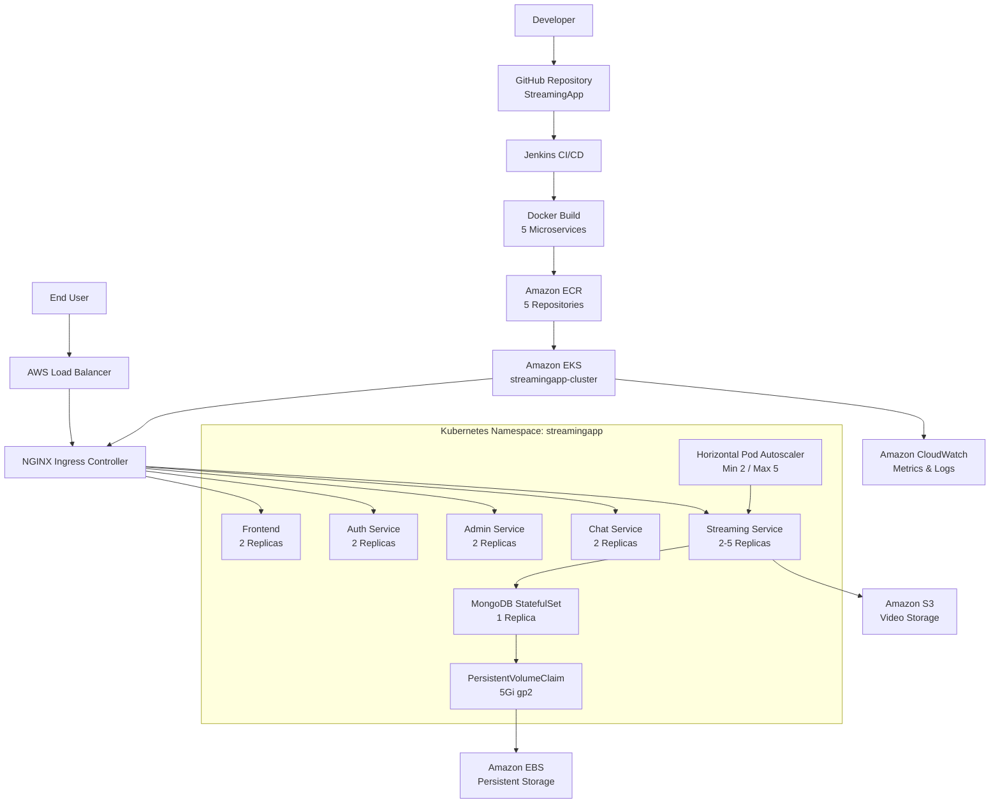
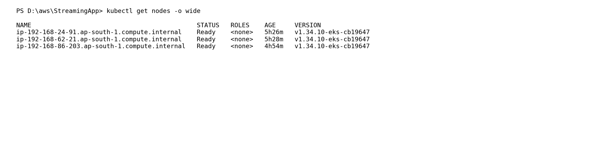
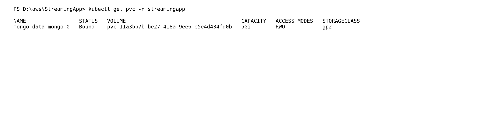
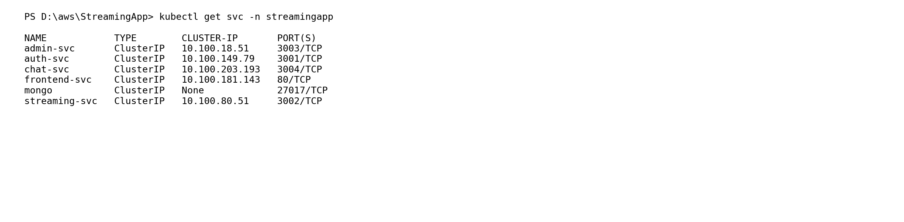
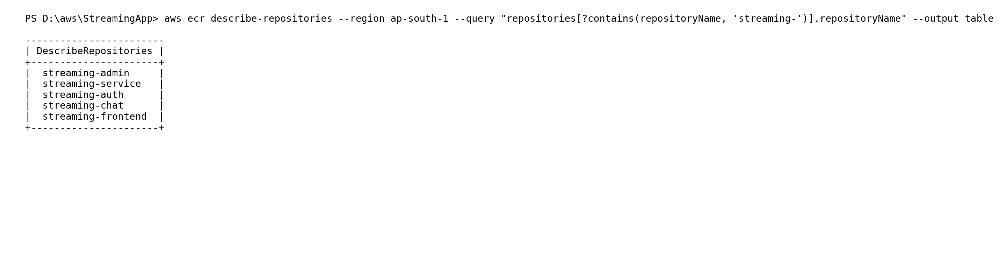
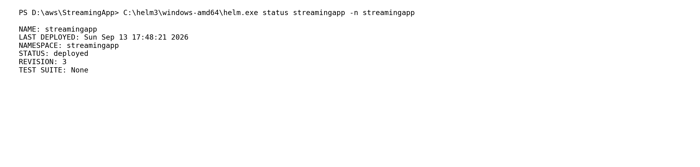
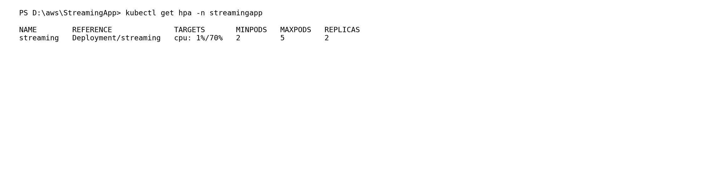
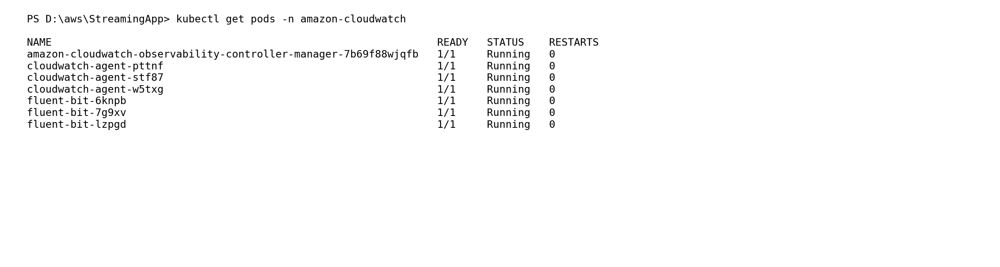

# StreamingApp – Kubernetes Container Orchestration & CI/CD

> **Submission Documentation**
>
> GitHub Repository: https://github.com/karan11619/StreamingApp  
> AWS Region: `ap-south-1` (Mumbai)  
> EKS Cluster: `streamingapp-cluster`  
> Kubernetes Namespace: `streamingapp`

---

## 1. Project Overview

StreamingApp is a microservices-based video streaming application deployed on **Amazon EKS** using Kubernetes.

The deployment demonstrates:

- Docker containerization
- Amazon ECR image storage
- Amazon EKS Kubernetes orchestration
- Kubernetes Deployments and Services
- MongoDB StatefulSet
- Persistent storage using AWS EBS
- EBS CSI Driver
- Horizontal Pod Autoscaler (HPA)
- NGINX Ingress
- AWS Load Balancer
- Amazon S3 video storage
- Amazon CloudWatch observability
- Helm package management
- Jenkins CI/CD
- GitHub source control

---

# 2. High-Level Deployment Flow

```text
Developer
    |
    v
GitHub
    |
    v
Jenkins CI/CD
    |
    +--> Checkout source
    |
    +--> Build 5 Docker images
    |
    +--> Login to Amazon ECR
    |
    +--> Tag & Push images
    |
    +--> Update EKS kubeconfig
    |
    +--> Helm Upgrade
    |
    +--> Rollout validation
    |
    v
Amazon EKS
    |
    +--> NGINX Ingress
    |
    +--> Frontend
    +--> Auth
    +--> Admin
    +--> Chat
    +--> Streaming
    +--> MongoDB
              |
              v
          AWS EBS

Streaming Service ---> Amazon S3
EKS                  ---> Amazon CloudWatch
```

---

# 3. Architecture Diagram



---

# 4. Main Deployment Steps

## Step 1 – Prepare the Application

The application consists of five containerized services:

| Service | Port | Docker Image |
|---|---:|---|
| Frontend | 80 | `streaming-frontend:1.0.2` |
| Authentication | 3001 | `streaming-auth:1.0.0` |
| Administration | 3003 | `streaming-admin:1.0.0` |
| Chat | 3004 | `streaming-chat:1.0.0` |
| Streaming | 3002 | `streaming-service:1.0.2` |

MongoDB is deployed separately as a StatefulSet.

---

## Step 2 – Create the EKS Cluster

Cluster:

```text
streamingapp-cluster
```

Region:

```text
ap-south-1
```

The EKS cluster contains **3 worker nodes**.

Validation command:

```powershell
kubectl get nodes -o wide
```

Result:

```text
3/3 nodes Ready
Kubernetes v1.34.10
```

### screenshot



---

## Step 3 – Configure Kubernetes Namespace

Application resources are isolated in:

```text
streamingapp
```

Typical command:

```powershell
kubectl get namespace
```

Application resources are then deployed using:

```powershell
kubectl -n streamingapp ...
```

---

## Step 4 – Configure Persistent Storage

MongoDB requires persistent storage.

A `5Gi` PVC using the `gp2` StorageClass was configured.

Validation:

```powershell
kubectl get pvc -n streamingapp
```

Result:

```text
mongo-data-mongo-0   Bound   5Gi   RWO   gp2
```

### screenshot



---

## Step 5 – Deploy MongoDB

MongoDB is deployed as a Kubernetes StatefulSet.

Important properties:

```text
StatefulSet: mongo
Replica: 1
Port: 27017
Storage: 5Gi
```

The MongoDB pod is:

```text
mongo-0
```

and is backed by the persistent volume claim.

---

## Step 6 – Configure Application Services

The application uses Kubernetes ClusterIP services for internal communication.

Validation:

```powershell
kubectl get svc -n streamingapp
```

Services:

```text
admin-svc
auth-svc
chat-svc
frontend-svc
mongo
streaming-svc
```

### screenshot



---

## Step 7 – Deploy the Microservices

The following Kubernetes Deployments are used:

```text
auth
admin
chat
frontend
streaming
```

Each normal application service runs with two replicas.

The Streaming deployment can scale from 2 to 5 replicas through HPA.

Validation:

```powershell
kubectl get pods -n streamingapp
```

Result:

```text
admin       2/2 Running
auth        2/2 Running
chat        2/2 Running
frontend    2/2 Running
streaming   2/2 Running
mongo       1/1 Running
```

All application pods had zero restarts during final validation.

### screenshot


---

# 5. Amazon ECR

Five ECR repositories were created:

```text
streaming-auth
streaming-admin
streaming-chat
streaming-frontend
streaming-service
```

AWS ECR registry:

```text
913436626979.dkr.ecr.ap-south-1.amazonaws.com
```

Validation command:

```powershell
aws ecr describe-repositories --region ap-south-1 --query "repositories[?contains(repositoryName, 'streaming-')].repositoryName" --output table
```

Output:

```text
streaming-admin
streaming-service
streaming-auth
streaming-chat
streaming-frontend
```

### screenshot



---

# 6. Amazon S3 Video Storage

Video content is stored in:

```text
Bucket: streamingapp-karan-2026
Object: theNights.mp4
```

The Streaming service uses this S3 bucket for video content.

A range request was validated successfully with:

```text
HTTP 206 Partial Content
```

This confirms byte-range retrieval support for the video object.

---

# 7. Helm Deployment

The Kubernetes resources are packaged in:

```text
helm/
```

Chart:

```text
streamingapp
```

Chart version:

```text
1.0.0
```

Application version:

```text
1.0.2
```

Helm release:

```text
streamingapp
```

Deploy command:

```bash
helm upgrade streamingapp ./helm \
  --install \
  -n streamingapp
```

On the Jenkins agent, Helm 3 is installed and used for deployment.

Validation:

```powershell
C:\helm3\windows-amd64\helm.exe status streamingapp -n streamingapp
```

Output:

```text
NAME: streamingapp
STATUS: deployed
REVISION: 3
```

### screenshot



---

# 8. Horizontal Pod Autoscaler

The Streaming service uses HPA.

Configuration:

```text
Minimum replicas: 2
Maximum replicas: 5
CPU target: 70%
```

Validation:

```powershell
kubectl get hpa -n streamingapp
```

Output:

```text
streaming   Deployment/streaming   cpu: 1%/70%   2   5   2
```

### screenshot



---

# 9. NGINX Ingress

NGINX Ingress Controller provides external routing.

Validation:

```powershell
kubectl get ingress -n streamingapp
```

Load Balancer:

```text
aed661b870a374b8a8216927189e499d-50718f108f720044.elb.ap-south-1.amazonaws.com
```

Application URL:

```text
http://aed661b870a374b8a8216927189e499d-50718f108f720044.elb.ap-south-1.amazonaws.com/
```

Routing:

| Path | Backend |
|---|---|
| `/` | `frontend-svc` |
| `/api/auth` | `auth-svc` |
| `/api/streaming` | `streaming-svc` |
| `/api/admin` | `admin-svc` |
| `/api/chat` | `chat-svc` |
| `/socket.io` | `chat-svc` |

### screenshot


---

# 10. AWS EBS CSI Driver

The EBS CSI Driver connects Kubernetes persistent volumes to AWS EBS storage.

The MongoDB PVC was validated as:

```text
Status: Bound
Capacity: 5Gi
Access Mode: RWO
StorageClass: gp2
```

This provides persistent storage for MongoDB.

---

# 11. CloudWatch Observability

Amazon CloudWatch observability was enabled for EKS.

Components:

```text
CloudWatch Observability Controller
CloudWatch Agent
Fluent Bit
```

Validation:

```powershell
kubectl get pods -n amazon-cloudwatch
```

Result:

```text
Controller: 1/1 Running
CloudWatch Agent: 3/3 Running
Fluent Bit: 3/3 Running
```

### screenshot



---

# 12. Jenkins CI/CD

Jenkins job:

```text
StreamingApp-CI-CD
```

GitHub repository:

```text
https://github.com/karan11619/StreamingApp
```

## Pipeline Stages

### Stage 1 – Checkout

```groovy
git branch: 'main',
    url: 'https://github.com/karan11619/StreamingApp.git'
```

### Stage 2 – Build Docker Images

```bash
docker build -t streaming-auth:1.0.0 backend/authService

docker build -t streaming-admin:1.0.0 \
  -f backend/adminService/Dockerfile backend

docker build -t streaming-chat:1.0.0 \
  -f backend/chatService/Dockerfile backend

docker build -t streaming-frontend:1.0.2 frontend

docker build -t streaming-service:1.0.2 \
  -f backend/streamingService/Dockerfile backend
```

### Stage 3 – Login to ECR

```bash
aws ecr get-login-password \
  --region "$AWS_REGION" |
  docker login \
  --username AWS \
  --password-stdin "$ECR_REGISTRY"
```

### Stage 4 – Tag Images

Example:

```bash
docker tag streaming-auth:1.0.0 \
  913436626979.dkr.ecr.ap-south-1.amazonaws.com/streaming-auth:1.0.0
```

Equivalent tagging is performed for all five services.

### Stage 5 – Push Images

```bash
docker push 913436626979.dkr.ecr.ap-south-1.amazonaws.com/streaming-auth:1.0.0

docker push 913436626979.dkr.ecr.ap-south-1.amazonaws.com/streaming-admin:1.0.0

docker push 913436626979.dkr.ecr.ap-south-1.amazonaws.com/streaming-chat:1.0.0

docker push 913436626979.dkr.ecr.ap-south-1.amazonaws.com/streaming-frontend:1.0.2

docker push 913436626979.dkr.ecr.ap-south-1.amazonaws.com/streaming-service:1.0.2
```

### Stage 6 – Configure EKS

```bash
aws eks update-kubeconfig \
  --region ap-south-1 \
  --name streamingapp-cluster
```

### Stage 7 – Deploy with Helm

```bash
helm upgrade streamingapp ./helm \
  --install \
  -n streamingapp
```

### Stage 8 – Validate Rollout

```bash
kubectl rollout status deployment/auth \
  -n streamingapp --timeout=180s

kubectl rollout status deployment/admin \
  -n streamingapp --timeout=180s

kubectl rollout status deployment/chat \
  -n streamingapp --timeout=180s

kubectl rollout status deployment/frontend \
  -n streamingapp --timeout=180s

kubectl rollout status deployment/streaming \
  -n streamingapp --timeout=180s
```

The final Jenkins pipeline completed with:

```text
StreamingApp CI/CD pipeline SUCCESS
Finished: SUCCESS
```

---

# 13. Jenkins CI/CD screenshot

The successful Jenkins run checked out commit:

```text
8d30a2db09643b7ff1f66b6e3e921ff60e699882
```

with commit message:

```text
Add Helm chart for CI/CD deployment
```

The pipeline then:

1. Built all five Docker images.
2. Logged into Amazon ECR.
3. Pushed all five images.
4. Updated EKS kubeconfig.
5. Successfully upgraded Helm release revision 3.
6. Successfully rolled out all five Deployments.
7. Finished with `SUCCESS`.

The Jenkins console output is the primary CI/CD screenshot for this section.

---

# 14. Final Kubernetes Validation

## Nodes

```bash
kubectl get nodes -o wide
```

Expected final state:

```text
3/3 Ready
```

## Pods

```bash
kubectl get pods -n streamingapp
```

Final state:

```text
admin       2/2 Running
auth        2/2 Running
chat        2/2 Running
frontend    2/2 Running
streaming   2/2 Running
mongo       1/1 Running
```

## Services

```bash
kubectl get svc -n streamingapp
```

Six services are present.

## HPA

```bash
kubectl get hpa -n streamingapp
```

```text
2 minimum
5 maximum
70% CPU target
```

## Persistent Storage

```bash
kubectl get pvc -n streamingapp
```

```text
5Gi
Bound
RWO
gp2
```

## Ingress

```bash
kubectl get ingress -n streamingapp
```

Both Ingress resources use:

```text
nginx
```

and the AWS Load Balancer address.

## CloudWatch

```bash
kubectl get pods -n amazon-cloudwatch
```

All CloudWatch components are Running.

---

# 15. Submission screenshot Checklist

Use the following screenshot in the final submission:

- [x] GitHub repository
- [x] EKS worker nodes
- [x] Kubernetes application pods
- [x] Kubernetes services
- [x] HPA
- [x] Persistent Volume Claim
- [x] NGINX Ingress
- [x] CloudWatch
- [x] Helm release
- [x] Amazon ECR repositories
- [x] Jenkins successful pipeline
- [x] Application Load Balancer
- [x] Amazon S3 video storage

---

# 16. Project Structure

```text
StreamingApp/
│
├── backend/
│   ├── authService/
│   ├── adminService/
│   ├── chatService/
│   └── streamingService/
│
├── frontend/
│
├── helm/
│   ├── Chart.yaml
│   ├── values.yaml
│   ├── .helmignore
│   └── templates/
│       ├── admin.yaml
│       ├── auth.yaml
│       ├── auth-ingress.yaml
│       ├── chat.yaml
│       ├── configmap.yaml
│       ├── frontend.yaml
│       ├── ingress.yaml
│       ├── mongo.yaml
│       ├── streaming-deployment.yaml
│       ├── streaming-hpa.yaml
│       └── streaming-service.yaml
│
└── README.md
```

---

# 17. Final Architecture Summary

| Layer | Technology |
|---|---|
| Source Control | GitHub |
| CI/CD | Jenkins |
| Containerization | Docker |
| Container Registry | Amazon ECR |
| Orchestration | Kubernetes |
| Kubernetes Platform | Amazon EKS |
| Package Management | Helm |
| Ingress | NGINX Ingress Controller |
| External Load Balancing | AWS Load Balancer |
| Database | MongoDB |
| Persistent Storage | AWS EBS / EBS CSI |
| Object Storage | Amazon S3 |
| Autoscaling | Kubernetes HPA |
| Monitoring & Logs | Amazon CloudWatch |
| Cloud Permissions | AWS IAM |

---

# 18. Final Result

The complete deployment pipeline was successfully validated:

```text
GitHub
   ↓
Jenkins
   ↓
Docker Build
   ↓
Amazon ECR
   ↓
Helm
   ↓
Amazon EKS
   ↓
Kubernetes
   ↓
NGINX Ingress
   ↓
Application
```

Final validated state:

```text
EKS Nodes              ✓ 3/3 Ready
Application Pods       ✓ Running
MongoDB                ✓ Running
Persistent Storage     ✓ Bound
Services               ✓ 6 Services
HPA                    ✓ 2-5 Replicas
Ingress                ✓ NGINX
ECR                    ✓ 5 Repositories
Helm                   ✓ Deployed, Revision 3
CloudWatch             ✓ Running
Jenkins CI/CD          ✓ SUCCESS
S3 Video Storage       ✓ Configured
```

# 👨‍💻 Repository

**StreamingApp**

https://github.com/karan11619/StreamingApp

**Status: READY FOR SUBMISSION 🚀**
